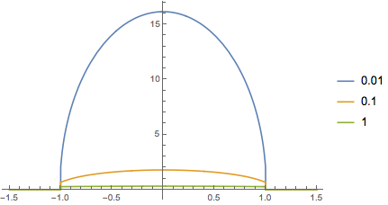
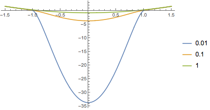

# Numerical Solutions of Lieb-Liniger Equations

Elliott H. Lieb and Werner Liniger in 1963 published an exact analysis of an interacting Bose gas:

- [E. Lieb and W. Liniger, Phys. Rev. 130, 1605 (1963)](http://dx.doi.org/10.1103/PhysRev.130.1605)
- [E. Lieb, Phys. Rev. 130, 1616 (1963)](http://dx.doi.org/10.1103/PhysRev.130.1616)

They found that the density of states (DOS) and spectrum satisfy respectively these equations:

<p align="center">
	
</p>

and

<p align="center">
	
</p>

where, following Section 3.8 of [my PhD thesis](http://etheses.bham.ac.uk/6320/1/Bovo15PhD.pdf), we put them in dimensionless unit in order to solve them numerically.  Here *λ* is the contact interaction strength and *m* is the chemical potential. These two equations are Fredholm Integral Equations of the Second Kind, and we see how to solve them in the next section.

The Mathematica notebook of the numerical solution is [available in this repository](Lieb-Liniger Equations.nb).

## Fredholm Equation

To solve Fredholm Integral Equations of the Second Kind, we define the following three functions:

- **BoundFunction:** This module takes the function *f* as input and as output gives the function *f* in the interval *[a,b]* and zero otherwise.

	```
	BoundFunction[f_, a_, b_] :=
		Function[
			Piecewise[{
				{0., # < a},
				{0., # > b},
				{f[#], True}}]
		];
	```

- **Fredholm2ndKind:** Gives the numerical solution of a Fredholm equation of the second kind in the interval *[a,b]*,

	<p align="center">
		
	</p>
	
	This takes as input the extremes of integration a and b, the kernel *K(x,y)*, *g(x)* and the number, *n*, of subdivision of the integration interval which is used in the numerical solution. This method is a [numerical adaptation](http://mathematica.stackexchange.com/questions/11594/integral-equation-numerical-solution-with-ndsolve) of [S. Rahbar and E. Hashemizadeh, *A Computational Approach to the Fredholm Integral Equation of the Second Kind*, Proceedings of the World Congress on Engineering, 2008](http://www.iaeng.org/publication/WCE2008/WCE2008_pp933-937.pdf).

	```
	Options[Fredholm2ndKind] = {Method -> Automatic};
	Fredholm2ndKind[{a_, b_, k_, g_}, n_?IntegerQ, OptionsPattern[]] :=
		Block[{step, SI, GI, KMatrix, W, DMatrix, f, deltaX, delta, fI, ftemp},
    	step = (b - a)/n;
		SI = Range[a, b, step];
		GI = g /@ SI;
		KMatrix = Outer[k, SI, SI];
		W = {step/2}~Join~ConstantArray[step, n - 1]~Join~{step/2};
		DMatrix = DiagonalMatrix[W];
		deltaX[x_?NumericQ] := 
		W.(k[x, #] & /@ SI) - NIntegrate[k[x, y], {y, a, b}]; 
		delta = deltaX /@ SI;
		fI = LinearSolve[IdentityMatrix[n + 1] + (DiagonalMatrix[delta] - KMatrix.DMatrix), GI];
		f = If[OptionValue[Method] === NoInterpolation,
			fI,
			BoundFunction[Interpolation[Transpose@{SI, fI}], a, b]];
		f];
	```

- **Fredholm2ndKindOut:**  Gives the numerical solution of the Fredholm equation in the interval *[c,d]* outside of *[a,b]*.This takes as input the extremes of integration *a* and *b*, the kernel *K(x,y)*, *g(x)*, the number, *n*, of subdivision of the integration interval *[a,b]* which is used in the numerical solution, the extreme of integration *c* and *d* of the interval outside *[a,b]* and the number of subdivisions of *[c,d]*.

	```
	Fredholm2ndKindOut[{a_, b_, k_, g_}, n_?IntegerQ, {c_, d_}, m_?IntegerQ, fIni_: True] :=
		Block[{fInTempi, stepIn, SIni, stepOut, SOuti, GOuti, KMatrixOut, fOuti},
		
		(* Variable inside the interval [a,b] *)
		stepIn = (b - a)/n;
		SIni = Range[a, b, stepIn]; (*i-th component of the interval*)
		fInTempi = If[fIni === True,
			Fredholm2ndKind[{a, b, k, g}, n, Method -> NoInterpolation],
			fIni];
		
		(* Variable and functions outside the interval [a,b] *)
		stepOut = (d - c)/m;
		SOuti = Range[c, d, stepOut]; (*i-th component of the interval*)
		GOuti = g /@ SOuti; (*i-th component of the g*)
		KMatrixOut = Outer[k, SOuti, SIni]; (*Matrix form of k*)
		fOuti = GOuti + stepIn*(KMatrixOut.fInTempi - (KMatrixOut[[All, 1]]*fInTempi[[1]] + KMatrixOut[[All, n + 1]]*fInTempi[[n + 1]])/2);
		BoundFunction[Interpolation[Transpose[{SOuti, fOuti}]], c, d]];
	```

## Numerical Solutions

With the above definitions we solve the two equations:

```
m = 0.5; (*Renormalized chemical potential*)
n = 1000; (*number of discretization*)

gLL[x_] := 1/(2*Pi);

gSolve[\[Lambda]_] := Block[{KLL, Out},
  KLL[x_, y_] := \[Lambda]/(Pi*(\[Lambda]^2 + (x - y)^2));
  Out = Fredholm2ndKind[{-1., 1., KLL, gLL}, n];
  Out]

eLL[x_] := -m + x^2;

eSolve[\[Lambda]_, a_, b_] := 
	Module[{KLL, fIni, fIn, fLeft, fRight, Out},
		
		KLL[x_, y_] := \[Lambda]/(Pi*(\[Lambda]^2 + (x - y)^2));
	  
		fIni = Fredholm2ndKind[{-1., 1., KLL, eLL}, n, Method -> NoInterpolation];
		fIn = Interpolation[Transpose[{Table[i, {i, -1., 1., 2./n}], fIni}]];
		fLeft = Fredholm2ndKindOut[{-1., 1., KLL, eLL}, n, {a, -1.}, n, fIni];
		fRight = Fredholm2ndKindOut[{-1., 1., KLL, eLL}, n, {1., b}, n, fIni];
	  
		Function[
			Piecewise[{
				{fLeft[#], a <= # < -1.},
				{fIn[#], -1. <= # <= 1.},
				{fRight[#], 1. < # <= b},
				{0., True}}]
		]
	
	]
```

## Plots

Finally, we plot the solutions of the density of states and spectrum.

### Density of States

```
PlotDOS[a_, b_] := Block[{gLLfunction1, gLLfunction2, gLLfunction3},

	(* Lieb-Liniger *)
	gLLfunction1 = gSolve[0.01];
	gLLfunction2 = gSolve[0.1];
	gLLfunction3 = gSolve[1];
	
	(* Plot *)
	Plot[{gLLfunction1[x], gLLfunction2[x], gLLfunction3[x]}, {x, a, b}, Exclusions -> None, PlotLegends -> {0.01, 0.1, 1}]];

PlotDOS[-1.5, 1.5]
```

This gives the density of states for three different values of λ:

<p align="center">
	
</p>

### Spectrum

```
PlotSpectrum[a_, b_] := 
  Block[{eLLfunction1, eLLfunction2, eLLfunction3},

	(* Lieb-Liniger *)
	eLLfunction1 = eSolve[0.01, a, b];
	eLLfunction2 = eSolve[0.1, a, b];
	eLLfunction3 = eSolve[1, a, b];

	(* Plot *)
	Plot[{eLLfunction1[x], eLLfunction2[x], eLLfunction3[x]}, {x, a, b}, Exclusions -> None, PlotLegends -> {0.01, 0.1, 1}]];

PlotSpectrum[-1.5, 1.5]
```

This gives the spectrum for three different values of λ:

<p align="center">
	
</p>
