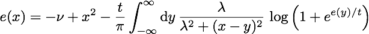
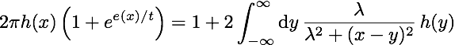
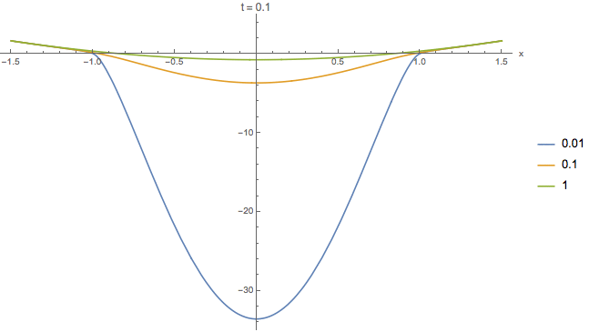
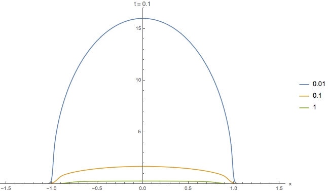

# Numerical Solutions of Yang-Yang Equations

Chen N. Yang and Chen P. Yang in 1969 published an exact analysis of the thermodynamics of an interacting Bose gas:

- [C. N. Yang and C. P. Yang, J. Math. Phys. 10, 1115 (1969)](http://dx.doi.org/10.1063/1.1664947)

They found that the spectrum and the density of states (DOS) satisfy respectively these equations:

<p align="center">
	
</p>

and

<p align="center">
	
</p>

where *λ* is the contact interaction strength, *m* is the chemical potential and *t* is the temperature. All quantities are in dimensionless units. The relations to the quantities in dimensional units are in Section 3.8 of [my PhD thesis](http://etheses.bham.ac.uk/6320/1/Bovo15PhD.pdf).

The Mathematica notebook of the numerical solution is [available in this repository](Yang-Yang Equations.nb), where in addition we evaluate the response of the DOS to a change in the chemical potential, *m*.

## Recursive Solution of Spectrum Equation

We solve the equation for the spectrum with a recursive procedure, until the solution reaches a defined precision.

```
eYY[\[Mu]_, t_, \[Lambda]_, a_, b_, n_, precision_] :=
	Block[{step, xi, \[Epsilon]0, \[Epsilon]0i, kc, kci, kT, \[Epsilon]i, \[Epsilon]iprev, converged, \[Epsilon]converged},
	
	converged = 0;
	step = (b - a)/(n - 1);
	xi = Range[a, b, step];
	\[Epsilon]0[k_] := -\[Mu] + k^2;
	\[Epsilon]0i = \[Epsilon]0 /@ xi;
	kc[x_, y_] := \[Lambda]/(Pi*(\[Lambda]^2 + (x - y)^2));
	kci = Outer[kc, xi, xi];
	kT[\[Epsilon]_] := t*Log[1 + Exp[-\[Epsilon]/t]];
	\[Epsilon]converged[\[CapitalDelta]\[Epsilon]_] := If[Abs[\[CapitalDelta]\[Epsilon]] < precision, 1, 0];
	\[Epsilon]i = \[Epsilon]0i;
	
	While[converged === 0,
		\[Epsilon]iprev = \[Epsilon]i;
		(* Trapezoidal rule sum *)
		\[Epsilon]i = \[Epsilon]0i - step*(kci.(kT /@ \[Epsilon]iprev) - (kci[[All, 1]]*kT[\[Epsilon]iprev[[1]]] + kci[[All, n]]*kT[\[Epsilon]iprev[[n]]])/2); 
		converged = Times @@ (\[Epsilon]converged /@ (\[Epsilon]iprev -\[Epsilon]i));
	];
	
	\[Epsilon]i]
```

## DOS equation: Fredholm approach

The equation for the density of states can be casted as a Fredholm Equation of the Second Kind. Using [this numerical approach](../Lieb-Liniger%20Equations) we solve it in the following way:

```
gYY[\[Mu]_, t_, \[Lambda]_, a_, b_, n_, precision_] := Block[{eYYDiscrete, eYYfunction, k, g},
	
	eYYDiscrete = eYY[\[Mu], t, \[Lambda], a, b, n, precision];
	eYYfunction = Interpolation[Transpose[{Table[i, {i, a, b, (b - a)/(n - 1)}], eYYDiscrete}]];
	g[x_] := 1/(2*Pi*(1 + Exp[eYYfunction[x]/t]));
	k[x_, y_] := 1/(1 + Exp[eYYfunction[x]/t])*\[Lambda]/(Pi*(\[Lambda]^2 + (x - y)^2));
	
	Fredholm2ndKind[{a, b, k, g}, n]
	];
```

## Plots

In the following we plot the solutions of the spectrum and density of states.

### Spectrum

```
PlotSpectrumComparision[a_, b_, t_] := Block[{eYYDiscrete1, eYYfunction1, eYYDiscrete2, eYYfunction2, eYYDiscrete3, eYYfunction3},

	(* Yang-Yang *)
	eYYDiscrete1 = eYY[m, t, 0.01, a, b, n, N[1/n]];
	eYYfunction1 = Interpolation[Transpose[{Table[i, {i, a, b, (b - a)/(n - 1)}], eYYDiscrete1}]];
	eYYDiscrete2 = eYY[m, t, 0.1, a, b, n, N[1/n]];
	eYYfunction2 = Interpolation[Transpose[{Table[i, {i, a, b, (b - a)/(n - 1)}], eYYDiscrete2}]];
	eYYDiscrete3 = eYY[m, t, 1., a, b, n, N[1/n]];
	eYYfunction3 = Interpolation[Transpose[{Table[i, {i, a, b, (b - a)/(n - 1)}], eYYDiscrete3}]];

	(* Plot *)
	Plot[{eYYfunction1[x], eYYfunction2[x], eYYfunction3[x]}, {x, a, b}, PlotRange -> {-35., 5.}, AxesLabel -> {"x"}, Exclusions -> None, PlotLegends -> {0.01, 0.1, 1}, PlotLabel -> "t = " <> ToString[t], ImageSize -> Large]];

PlotSpectrumComparision[-1.5, 1.5, 0.1]
PlotSpectrumComparision[-1.5, 1.5, 1]
PlotSpectrumComparision[-1.5, 1.5, 1.4]
```

This gives the spectrum for three different values of λ,

<p align="center">
	
</p>

and we combined the three pictures at different temperatures *t* in a gif.

### Density of States

```
PlotDOSComparision[a_, b_, t_] := Block[{gYYfunction1, gYYfunction2, gYYfunction3},
   (* Yang-Yang *)
   
   gYYfunction1 = gYY[m, t, 0.01, a, b, n, N[1/n]];
   gYYfunction2 = gYY[m, t, 0.1, a, b, n, N[1/n]];
   gYYfunction3 = gYY[m, t, 1., a, b, n, N[1/n]];
   (* Plot *)
   
	Plot[{gYYfunction1[x], gYYfunction2[x], gYYfunction3[x]}, {x, a, b}, 	PlotRange -> {.0, 17.}, Exclusions -> None, AxesLabel -> {"x"}, Exclusions -> None, PlotLegends -> {0.01, 0.1, 1}, PlotLabel -> "t = " <> ToString[t], ImageSize -> Large]];

PlotDOSComparision[-1.5, 1.5, 0.1]
PlotDOSComparision[-1.5, 1.5, 1.]
PlotDOSComparision[-1.5, 1.5, 1.4]
```

This gives the density of states for three different values of λ,

<p align="center">
	
</p>
